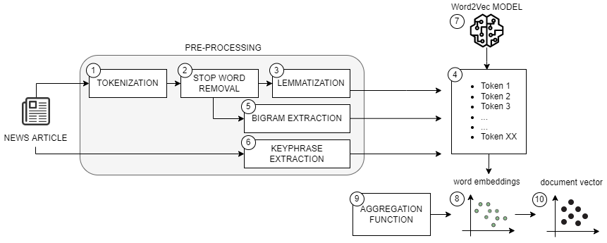

# Word2Vec-for-text-categorization

<b>"model M3.kv"</b> is the Word2Vec model obtained by training the model of [1] on a dataset of 17,500 Italian news articles related to crime events.

<b>[html] preprocessing and document embeddings.html, [ipynb] preprocessing and document embeddings.ipynb</b>: python code for extracting the embeddings of the input documents through a pre-processing phase, training a Word2Vec model or loading an existing model, and applying the model to the pre-processing output to obtain the document vectors (Figure 1).
The parameter "configuration" refers to the three configurations of the pre-processing:
1. configuration=1 --> tokenization + stop word removal
2. configuration=2 --> tokenization + stop word removal + lemmatization
3. configuration=3 --> tokenization + stop word removal + lemmatization + keyphrase extraction


Fifure 1 - Document vector extraction.

<b>[html] supervised_classification.html, [ipynb] supervised_classification.ipynb</b>: python code for the application of 15 supervised categorization algorithms to the document vectors.

<b>[html] unsupervised_classification.html, [ipynb] unsupervised_classification.ipynb</b>: python code for the application of 4 unsupervised categorization algorithms to the document vectors.

**If the code is useful, please consider citing paper using the BibTex entry below.**

```
@inproceedings{bonisoli2021fedcsis,
  author    = {Giovanni Bonisoli and
               Federica Rollo and
               Laura Po},
  editor    = {Maria Ganzha and
               Leszek A. Maciaszek and
               Marcin Paprzycki and
               Dominik Slezak},
  title     = {Using Word Embeddings for Italian Crime News Categorization},
  booktitle = {Proceedings of the 16th Conference on Computer Science and Intelligence Systems, Online, September 2-5, 2021},
  pages     = {461--470},
  year      = {2021},
  url       = {https://doi.org/10.15439/2021F118},
  doi       = {10.15439/2021F118}
}
```

[1] Di Gennaro G., Buonanno A., Di Girolamo A., Ospedale A., Palmieri F.A.N., Fedele G. (2021) 
An Analysis of Word2Vec for the Italian Language. In: Esposito A., Faundez-Zanuy M., Morabito F., Pasero E. 
(eds) Progresses in Artificial Intelligence and Neural Systems. Smart Innovation, Systems and Technologies, 
vol 184. Springer, Singapore. https://doi.org/10.1007/978-981-15-5093-5_13
